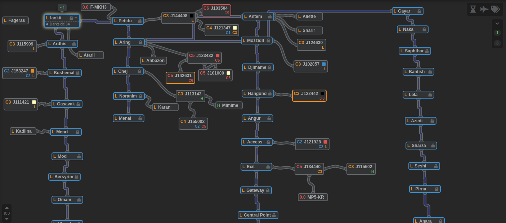
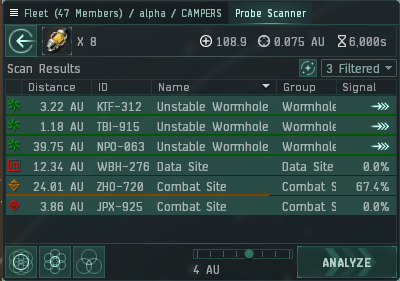
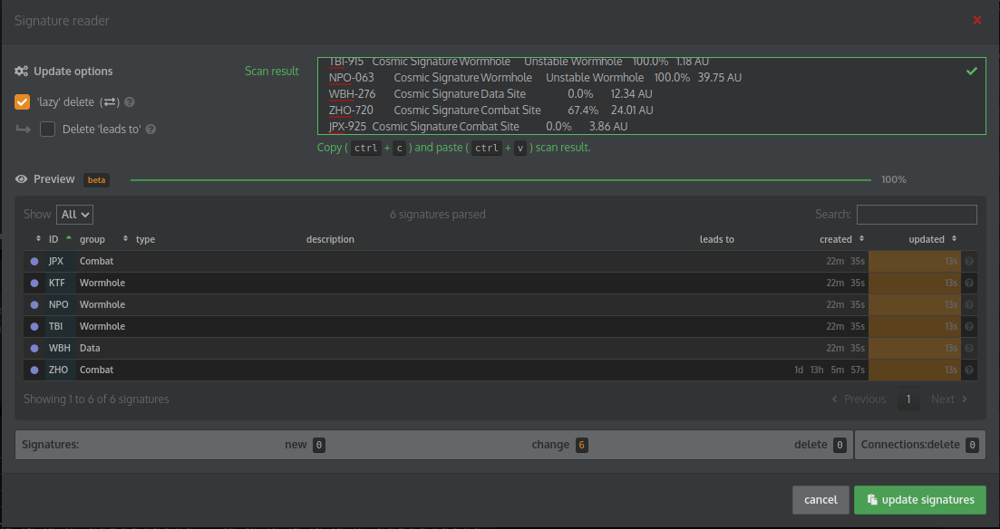
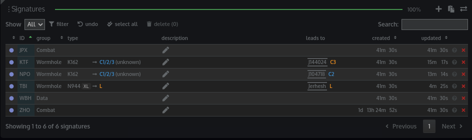
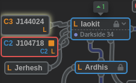

Scanning Guide
==============

We use Pathfinder for our wormhole guides, this won't cover all the ins and outs of Pathfinder, but I will go over
some tips and tricks to speed up our probing.

Map Layout
----------

Our chain maps are centered on a staging system, and extend
radially from it. They don't actually represent the exact connections between lowsec systems, but are rather arranged
linearly so that you can right click add waypoint to each system on a chain in order to scan the whole chain. As a
result, the actual path you take will backtrack sometimes.

This also allows us to easily divvy up scanning responsibilities.

For example, here is a screenshot of the Krabbi Kador map:

https://www.pathfinder-w.space/

If I say "I'm going to scan the Ardhis Chain, you go scan the Petidu Chain" then the assumption is that I'm going to
probe Ardhis, Bushemal, Gasavak, Menri and so on. And I would expect you to scan Petidu, Aring, Chej, Noranim, and
Menai.

This allows us to de-duplicate our efforts, and also ensures that closer holes are found quicker.

Where to probe?
---------------

The criteria for what holes we daytrip in is contained in :ref:`WH Selection`. How to find them is more of an art and
less of a science. Occasionally, direct connects to C5s and C6s will be unavailable and you will need to probe out some
C3s to find them, when to fully probe out C3s vs just moving to the next system is going to depend on a lot of factors.

Entering Sigs Quickly
---------------------

The easiest way to add sigs to Pathfinder is to first probe out all the sigs in a system. You don't need to fully probe
them, but probe them at least to the point where you can see the type of the site.

Then, in this window, ``CTRL + A`` and ``CTRL + C`` to pull all the results to your keyboard.

Next, In Pathfinder, select your current system by clicking on it and then scrolling to the bottom of the screen. Click
on the middle toprighthand button labeled "Signature Reader". Check the ``'lazy' delete`` box, and then paste the sigs
into the text field and click update sigs. Now, as you warp to each wormhole, select it's type and connection
(connections won't auto-populate in the selection list until you actually visit the other side.)

.. important::

    Please actually add the connected systems for each wormhole to it's sig in the origin system. That way when someone
    else updates the scan results, disconnected wormholes/systems will automatically be removed.

So, as an example, once I finished probing those sigs, here is the result of the signatures section of Pathfinder:

And here is what the map looks like:

Importantly, note that all WHs were classified and linked to destination systems (allowing for their automatic removal
by people importing new sigs and clicking the lazy delete box. Also note that J104718 is outlined in red. This denotes
that I found structures belonging to a hostile entity (and I put the name of said entity in the notes.)

Additionally, if you found any good sites (outlined in the :ref:`Preferred Sites` section), add the totals of each site
type to the notes as well.