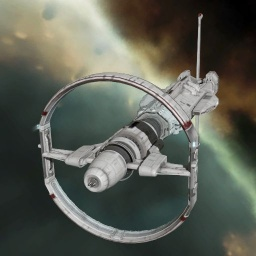
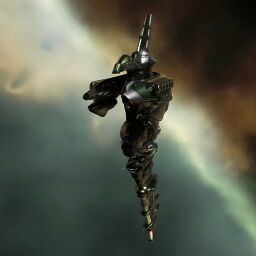

The Fleet
=========

Nestor
------

Nestors are the backbone of our Daytripping fleets, they provide logistical support, damage (via drones), and refit
capability.

Fitting
^^^^^^^

The following is the standard nestor fit:

.. code-block::

    [Nestor, Standard Nestor]
    Dread Guristas Drone Damage Amplifier
    Imperial Navy Multispectrum Energized Membrane
    Dread Guristas Drone Damage Amplifier
    Centum C-Type Multispectrum Energized Membrane
    1600mm Steel Plates II
    Damage Control II

    Large Micro Jump Drive
    Republic Fleet Large Cap Battery
    Thukker Large Cap Battery
    Heavy Warp Scrambler II
    Omnidirectional Tracking Link II
    Omnidirectional Tracking Link II

    Large Remote Armor Repairer II
    Large Remote Armor Repairer II
    Large Remote Armor Repairer II
    Drone Link Augmentor II
    Large Remote Capacitor Transmitter II
    Large Remote Capacitor Transmitter II
    Large Remote Capacitor Transmitter II

    Large Remote Repair Augmentor II
    Large Egress Port Maximizer I
    Large Egress Port Maximizer II

    Warrior II x5
    Hammerhead II x5
    Praetor II x10
    Curator II x7

    Tracking Speed Script x2
    Core Scanner Probe I x20
    Optimal Range Script x2
    Heavy Stasis Grappler II x1
    Core Probe Launcher II x1
    Improved Cloaking Device II x1
    Large EMP Smartbomb II x1

Please ensure that you have everything listed in the cargo. It is only acceptable to substitute these items:

 - Core Probe launcher T1 or Faction (This is more for saving your own ass if things go very wrong)
 - Cloaking device can be whatever you want
 - Large EMP Smartbomb can be Meta or Faction (longer range preferred)
 - Alternate Drone Loadout (See Below)

Please ensure you have the skills to use all other modules and drones.

During the course of a fleet, you may be asked to refit a Heavy Stasis Grappler, or Smartbomb. If asked:

 - Replace the `Drone Link Augmentor II` with the smartbomb
 - Replace one of the `Omnidirectional Tracking Link II` with the `Heavy Stasis Grappler II`

Minimum Skills
^^^^^^^^^^^^^^

In addition to being able to use all modules, the following skills are required to ensure that
we can run sites in a timely and safe manner:

.. code-block::

    Amarr Battleship IV
    Gallente Battleship IV

In addition, the below skills are *highly* encouraged. Don't let these stop you from running a nestor,
but please ensure you are working on training them ASAP on your nestor characters:

.. code-block::

    Capacitor Emissions System V
    Advanced Target Management II

Alternate Drone Loadout
^^^^^^^^^^^^^^^^^^^^^^^

If desired, the drone layout can be changed to include Geckos, which have a higher overall damage output in combination
with medium and light drones. Use the above standard fit, but with this drone loadout:

.. code-block::

    Gecko x4
    Curator II x9
    Acolyte II x5
    Infiltrator II x5

This drone loadout increases the total cost of the nestor, but has some advantages:

 - Higher damage output against sleepers (~100dps)
 - Somewhat higher average damage output against drifters
 - Allows you to carry extra heavy drones and sentry drones in addition to lights and mediums

During PVE, you will launch the following in order to achieve the highest dps:

.. code-block::

    2x Geckos
    1x Infiltrator II
    2x Acolyte II

Eos
---

The Eos serves as drone bunny as well as providing Armor Links. We run 1 Eos for every 10 Nestors due to
drone assist limits.

Fitting
^^^^^^^

.. code-block::

    [Eos, *Standard Eos]
    Damage Control II
    Imperial Navy 1600mm Steel Plates
    Dark Blood Multispectrum Energized Membrane
    Dread Guristas Drone Damage Amplifier
    Corelum C-Type Explosive Energized Membrane
    Dread Guristas Drone Damage Amplifier
    Dark Blood Multispectrum Energized Membrane

    Republic Fleet Target Painter
    Medium Micro Jump Drive
    Warp Scrambler II
    Omnidirectional Tracking Link II

    Armor Command Burst II
    Armor Command Burst II
    Sisters Core Probe Launcher
    Dark Blood Medium Energy Nosferatu
    Drone Link Augmentor II

    Medium Trimark Armor Pump II
    Medium Trimark Armor Pump II

    Warrior II x5
    Praetor II x6
    Curator II x5

    Sisters Core Scanner Probe x24
    Rapid Repair Charge x2300
    Armor Energizing Charge x2300
    Optimal Range Script x1
    Tracking Speed Script x1
    Improved Cloaking Device II x1
    Mobile Tractor Unit

As with the Nestor, there are some modules that can be substituted:

    - Scan probe launcher/probes
    - Nosferatu can be Meta or T2
    - Cloaking device can be T1

.. warning::

    Beware that the Eos doesn't have the same probing bonus as the Nestor, so if you have bad scanning skills
    you may struggle to probe yourself out of wormholes with T1 Probes if you get stuck.