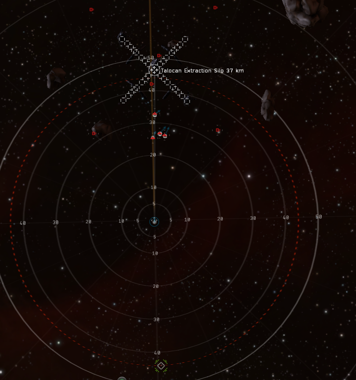
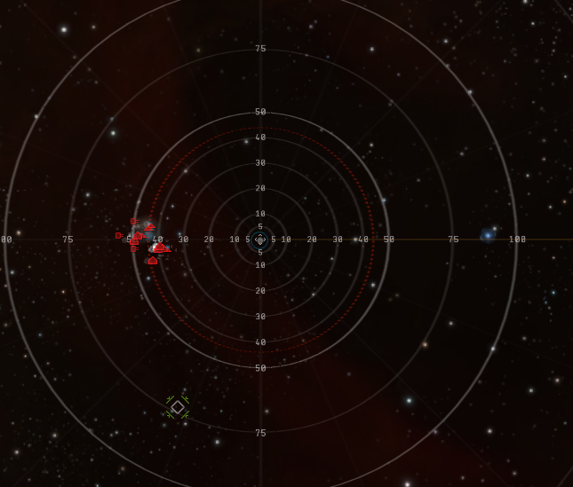
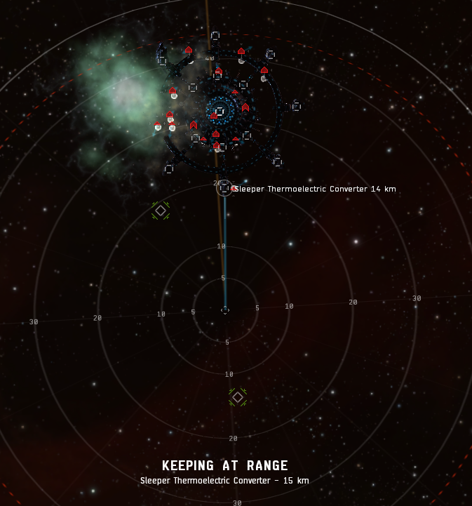

.. _WH Selection:

Wormhole Selection and Prep
===========================

We run Nestors in C5 and C6 wormholes.

With larger groups (15+) we prefer shattered wormholes, but do not run shattereds with small groups.

We will generally only run 2 jumps deep into any wormhole chain from lowsec.

The wormhole must not be EOL or critical at the time we are getting ready to farm it.

Ideal wormhole effects are:

.. code-block::

    None
    Magnetar
    Red Giant

Less ideal, but still viable:

.. code-block::

    Wolf Rayet
    Black Hole

Not viable:

.. code-block::

    Pulsar
    Cataclysmic Variable

.. _Preferred Sites:

Preffered Sites
---------------

We prefer the following sites:

.. code-block::

    Core Stronghold
    Core Garrison
    Core Citadel
    Core Bastion

Preliminary Checks
------------------

In order to krab a hole, a few things need to be checked:

    - All sigs must be scanned and entered into Siggy (So we can immediately probe down connections into our hole)
    - Neut alts should be posted cloaked on the other sides of connections when possible
    - The hole must A) be unoccupied, B) be occupied by EUTZ corps, or C) Be occupied by shitters
    - Check all structures to ensure no one is currently docked and active (Upwell structures show player counts
      in brackets in their display string)

Site Prep
---------

Some sites have default warpins that will put Sleeper spawns out of effective drone range.
To speed up these sites, it is highly beneficial to create a new warpin bookmark using cloaky eyes.

Please ensure the first three letters of the SIG ID as well as the site name are in the bookmark name, I.E.:

``OZU Core Stronghold Warpin``

If a site type isn't listed here, the default warpin is fine.

C5 - Core Stronghold
^^^^^^^^^^^^^^^^^^^^

Set keep at range ~40km to the ``Talocan Extraction Silo``

This image shows correct positioning:

C5 - Core Garrison
^^^^^^^^^^^^^^^^^^

Move at about a 45 degree angle to the right of the main spawn until you are in-between the main spawn and the
glowy blue orb thing.

This image shows correct positioning:

C6 - Core Bastion
^^^^^^^^^^^^^^^^^

Set keep at range 15km to the *closest* ``Sleeper Thermoelectric Converter``.

This image shows correct positioning:

